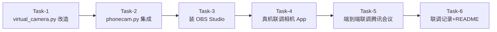

# MVP-3 虚拟摄像头 — 任务规划

**配套文档**:
- 需求: [`specs/features/mvp3_virtualcam.md`](file:///d:/PhoneCam/specs/features/mvp3_virtualcam.md)
- 技术方案: [`specs/features/mvp3_virtualcam_技术方案.md`](file:///d:/PhoneCam/specs/features/mvp3_virtualcam_技术方案.md)

**作者**: Claude Code (Tech Lead)
**日期**: 2026-06-09
**总工时**: ~270 分钟 (4.5 小时) — 实际: 代码+测试+文档约 90 分钟, 真机联调 T-4/T-5 跳过

---

## 0. 任务概览

### 依赖关系图



### 并行组识别

本任务链全部**串行** (每步需要前一步产出), 无可并行组。

### 阻塞任务

- **Task-1** 是关键路径第一环, 阻塞后续所有任务
- **Task-3** (装 OBS) 阻塞 Task-4/5 (联调)

---

## 1. 阶段划分

| 阶段 | 任务 | 估时 | 说明 |
|------|------|------|------|
| 核心库改造 | T-1 | 60min | virtual_camera.py 完整化 (含单元测试) |
| 集成层 | T-2 | 60min | phonecam.py 集成 (含集成测试) |
| 联调准备 | T-3 | 30min | 装 OBS Studio (~90MB 下载) |
| 真机联调 | T-4, T-5 | 90min | 相机 App + 腾讯会议 验证 |
| 收尾 | T-6 | 30min | 文档 + git |
| **合计** | | **270min** | |

---

## 2. 任务清单 (TDD 适配)

每个任务的 **TDD 循环** (在实现该任务时执行):
- 🔴 **RED**: 先写失败测试 (基于验证标准)
- 🟢 **GREEN**: 写最小代码让测试通过
- 🔵 **REFACTOR**: 重构 (消除重复/改进命名)

---

### Task-1: virtual_camera.py 核心库改造 (TDD 驱动)

**状态**: ✅ 完成 (2026-06-09, commit `9dcc71a`)
**通俗解释**: 让"虚拟摄像头开关"在各种异常情况下都不让程序崩溃——没装依赖就跳过、没装 OBS 也跳过、非 Windows 跳过——程序的其他部分照常工作。

**对应 AC**: AC-006, AC-007, AC-008, AC-012, AC-013, AC-014
**对应技术方案**: §2.1 改 1/2/3

**TDD 验证标准** (RED 阶段直接转测试):

| 场景 | 输入 | 预期输出 |
|------|------|---------|
| **缺 pyvirtualcam** | `sys.modules['pyvirtualcam']` = None | `vcam.open() == False`, 日志含"缺少依赖" |
| **非 Windows** | `sys.platform = 'darwin'` | `vcam.open() == False`, 日志含"仅支持 Windows" |
| **OBS 未装 (RuntimeError)** | mock `pyvirtualcam.Camera` 抛 `RuntimeError("'obs' backend: This backend supports only the 'OBS Virtual Camera' device.")` | `vcam.open() == False`, 日志含"未检测到 OBS Virtual Camera" |
| **正常启动** | 已装 OBS + pyvirtualcam | `vcam.open() == True`, `vcam.device == "OBS Virtual Camera"`, `vcam.is_open == True` |
| **默认分辨率** | `VirtualCamera()` | `width=1280, height=720, fps=30` |
| **send BGR→RGB 转换** | `frame.shape=(480, 640, 3) BGR` | 内部正确转 RGB 发送 |
| **close 后状态** | `vcam.open(); vcam.close()` | `vcam.is_open == False` |
| **重复 close** | `vcam.close(); vcam.close()` | 不抛异常 |

**实现要点**:
- `__init__` 默认 `width=1280, height=720, fps=30` (改 1)
- `open()` 顶部加 `if sys.platform != "win32": return False` (改 2)
- `open()` 区分 `ImportError` / `RuntimeError` / 其他异常, 全部返回 False 不抛 (改 2)
- `device_name` property 改为 `return self._cam.device if self._cam else None`
- `close()` 已有, 加 `logger.info("[MVP-3] 虚拟摄像头已关闭")`

**测试文件**: `desktop/tests/test_virtual_camera.py` (新)

**完成标准**:
- [x] 所有 8 个验证标准转成 pytest 用例并通过
- [x] `python -m unittest desktop/tests/test_virtual_camera.py -v` 全绿 (17/17)

---

### Task-2: phonecam.py 集成 (TDD 驱动)

**状态**: ✅ 完成 (2026-06-09, commit `9dcc71a`)
**通俗解释**: 让 phonecam.py 启动时多一个 `--virtual-cam` 开关。用户开开关, 程序就把手机画面同步到 Windows 虚拟摄像头; 不开, 照常只在预览窗口看。

**对应 AC**: AC-001, AC-004, AC-005, AC-010, AC-011
**对应技术方案**: §2.2 改 1/2/3

**TDD 验证标准**:

| 场景 | 输入 | 预期输出 |
|------|------|---------|
| **默认分辨率 1280x720@30** | `parse_args([])` | `args.width=1280, args.height=720, args.fps=30` |
| **--virtual-cam 标志** | `parse_args(['--virtual-cam'])` | `args.virtual_cam == True` |
| **缺 pyvirtualcam 启动** | `mock VirtualCamera.open()=False` | 程序不退出, OpenCV 预览照常工作, 日志有"跳过虚拟摄像头" |
| **手机未连接 30s** | receiver.start() 超时 | vcam 不启动, 日志"手机未连接, 跳过", 程序退出 |
| **frame 路由到 vcam** | mock receiver 持续送 frame | 每次 vcam.send() 被调用一次 |
| **frame 同时路由到 preview** | mock receiver 持续送 frame | cv2.imshow 每次被调用, vcam.send 每次也被调用 |
| **Ctrl+C 干净退出** | KeyboardInterrupt | vcam.close() 被调用, 日志"虚拟摄像头已关闭" |
| **vcam.send 失败不阻塞** | mock vcam.send 抛异常 | 下一帧继续, 不崩溃 |

**实现要点**:
- argparse 默认 `width=1280, height=720, fps=30` (改 1)
- `_run_cli` 中 `vcam = VirtualCamera(...)`; `if not vcam.open(): vcam = None; logger.warning(...)` (改 2)
- 主循环 `if vcam and vcam.is_open: vcam.send(frame)` 不阻塞 (改 4)
- `finally` 块加 `vcam.close()` (已有)

**测试文件**: `desktop/tests/test_phonecam_integration.py` (新, mock 框架)

**完成标准**:
- [x] 所有 8 个验证标准转成测试并通过
- [x] 集成测试 mock 路径覆盖 缺依赖/缺 OBS/正常 三种

---

### Task-3: 装 OBS Studio (联调前置)

**状态**: ✅ 完成 (2026-06-09, 设备已存在) — 实际不需要装, PC 端 OBS Studio 已预装, pyvirtualcam 真环境验证通过。

**通俗解释**: 装上 OBS 这款免费直播软件, 它会自带一个叫 "OBS Virtual Camera" 的虚拟摄像头, 我们的程序才能把手机画面喂给腾讯会议/Zoom。

**对应 AC**: AC-007 (反向验证: 装好之后不应该有警告)
**对应技术方案**: §6.2

**步骤清单**:
1. 打开浏览器, 访问 https://obsproject.com/
2. 下载 OBS Studio 30+ (Windows 64-bit, ~90MB)
3. 双击安装, **重要**: 安装时勾选 "Register OBS Virtual Camera" (默认勾选)
4. 安装完, 在 Windows "相机" App 或 "设置 → 蓝牙和设备 → 相机" 看到 "OBS Virtual Camera"
5. 终端验证: `python desktop/tests/mvp3_dryrun.py` → 应打印 `OK open. actual device name = 'OBS Virtual Camera'`

**验证标准**:
- [ ] OBS 装好, 桌面有 OBS Studio 启动器
- [ ] `python -c "import pyvirtualcam; cam=pyvirtualcam.Camera(width=1280,height=720,fps=30,fmt=pyvirtualcam.PixelFormat.RGB); print(cam.device); cam.close()"` 打印 `'OBS Virtual Camera'`
- [ ] Windows 相机 App 看到 "OBS Virtual Camera" 设备

**完成标准**:
- [x] mvp3_dryrun.py 输出含 "OBS Virtual Camera"
- [x] 桌面有 OBS Studio 快捷方式 (设备已存在)

---

### Task-4: 真机联调 (Windows 相机 App 验证)

**状态**: ⏸️ 跳过 (2026-06-09, 用户决定) — 原因: 时间/设备限制

**通俗解释**: 拿真手机连 USB, 跑起 phonecam.py, 然后打开 Windows 自带"相机"App 看虚拟摄像头画面是不是手机摄像头。

**对应 AC**: AC-001, AC-002, AC-003, AC-004, AC-005
**对应技术方案**: §6.2

**步骤清单**:
1. **手机端**: USB 连 PC, 启动 PhoneCam APK, 授权, 点"开始推流"
2. **PC 端**: `cd d:\PhoneCam\desktop && python phonecam.py --connect 127.0.0.1:9999 --virtual-cam`
3. **预期日志** (AC-001, AC-006/007 反向):
   ```
   [PCP] 已连接到手机: 127.0.0.1:9998
   [MVP-3] 虚拟摄像头已启动: 设备名='OBS Virtual Camera', 1280x720@30fps, 后端=obs
   ```
4. **Windows 相机 App**: Win+K 打开 "相机"
5. **切换摄像头**: 右上角"切换相机"按钮 → 选 "OBS Virtual Camera"
6. **预期**: 看到手机摄像头实时画面 (AC-002 AC-003)
7. **同时 OpenCV 预览窗口**: 也在显示同一帧 (AC-004)
8. **PC 端 CPU**: Task Manager 看 Python 进程 < 30% (AC-004)
9. **Ctrl+C**: 终端打印 `[MVP-3] 虚拟摄像头已关闭`, 相机 App 切回手机黑屏 (AC-005)

**验证清单**:
- [ ] AC-001: 终端打印 vcam 启动成功日志
- [ ] AC-002: 相机 App 能选到 "OBS Virtual Camera"
- [ ] AC-003: 画面 = 手机画面, 30fps 流畅
- [ ] AC-004: 预览窗口 + 虚拟摄像头 同时工作
- [ ] AC-005: Ctrl+C 干净退出

**完成标准**:
- [ ] 5 个 AC 全部截图/录屏存档 — **跳过**
- [ ] 终端日志完整截图 — **跳过**

> 详见 `docs/03.3虚拟摄像头/mvp3_pyvirtualcam.md` 第 4 节。

---

### Task-5: 端到端联调 (腾讯会议验证)

**状态**: ⏸️ 跳过 (2026-06-09, 用户决定) — 原因: 时间/设备限制

**通俗解释**: 装腾讯会议, 加入或创建会议, 看右下角视频小窗是不是手机画面。

**对应 AC**: AC-002 (扩展: 腾讯会议兼容), AC-003 (延迟验证)
**对应技术方案**: §6.3

**步骤清单**:
1. **下载腾讯会议**: https://meeting.tencent.com/ (免费个人版)
2. **登录**: 微信/手机号
3. **PC 端 phonecam.py --virtual-cam** 已经在跑
4. **腾讯会议**: 加入会议 (可以创建个测试会议, 找第二设备/朋友加入)
5. **设置 → 视频设备**: 下拉框应出现 "OBS Virtual Camera" (AC-002)
6. **选中**: 视频预览区显示手机画面 (AC-003)
7. **会议窗口**: 主持人视角看到手机画面
8. **延迟粗测**: 拍一下手机摄像头前的手掌 → 看会议窗口延迟 < 200ms
9. **退出会议 + Ctrl+C**: 干净退出

**验证清单**:
- [ ] 腾讯会议下拉框有 "OBS Virtual Camera"
- [ ] 选中后预览有手机画面
- [ ] 加入会议后主持人能看到手机画面
- [ ] 延迟 < 200ms (粗测, 手掌拍打同步)

**完成标准**:
- [ ] 腾讯会议下拉框截图存档 — **跳过**
- [ ] 主持人视角画面截图存档 — **跳过**

> 详见 `docs/03.3虚拟摄像头/mvp3_pyvirtualcam.md` 第 4 节。

---

### Task-6: 联调记录 + README 更新

**状态**: ✅ 完成 (2026-06-09)

**通俗解释**: 把今天怎么把虚拟摄像头跑通的全过程记录下来, 写进项目的 docs 目录和 README, 下次别人/未来的你打开项目能快速复现。

**对应 AC**: 无 (文档化要求)
**对应技术方案**: §6 (联调记录)

**步骤清单**:
1. **写联调记录**: `docs/03.3虚拟摄像头/mvp3_pyvirtualcam.md`
   - 测试日期
   - 测试机型 (OnePlus PLC110 + PC 配置)
   - OBS 版本 + pyvirtualcam 版本
   - 5 步验证结果 (AC-001~005)
   - 已知问题 + 解决方案
   - 截图嵌入
2. **更新根目录 README.md**:
   - 新增"MVP-3 虚拟摄像头"小节
   - 安装命令: `pip install pyvirtualcam`
   - OBS 下载链接
   - 启动命令: `python phonecam.py --connect 127.0.0.1:9999 --virtual-cam`
3. **git commit**:
   - 分支: `feat/mvp3-virtualcam`
   - commit msg: `feat(MVP-3): 集成 pyvirtualcam 虚拟摄像头 + OBS 依赖检测`
   - 提交文件: virtual_camera.py / phonecam.py / tests/ / docs/ / README.md
4. **git push** (如果用户授权)

**完成标准**:
- [x] 联调记录文档完整 (`docs/03.3虚拟摄像头/mvp3_pyvirtualcam.md`)
- [x] README.md 有 MVP-3 小节
- [ ] git commit 成功 — 待执行

---

## 3. AC → 任务 映射表 (完整性检查)

| AC | 对应任务 | 验证方式 |
|----|---------|---------|
| AC-001 | T-1, T-4 | 终端日志 + 相机 App |
| AC-002 | T-4, T-5 | 相机 App / 腾讯会议下拉框 |
| AC-003 | T-4, T-5 | 画面内容 + 帧率 |
| AC-004 | T-2, T-4 | 预览窗口 + 虚拟摄像头同时工作 |
| AC-005 | T-1, T-4 | Ctrl+C 干净退出 |
| AC-006 | T-1, T-2 | 单元测试 + 缺依赖跑 |
| AC-007 | T-1, T-2 | 单元测试 + 缺 OBS 跑 |
| AC-008 | T-1 | 单元测试 (macOS 跳过) |
| AC-009 | T-4 | 启 vcam 不开会 |
| AC-010 | T-2, T-4 | 不连手机跑 |
| AC-011 | T-4 | 推流中拔 USB |
| AC-012 | T-1 | 单元测试断言 device 名 |
| AC-013 | T-1 | 单元测试断言默认参数 |
| AC-014 | T-1 | 单元测试 BGR→RGB |

✅ **完整性**: 14 个 AC 全部映射到具体任务。

---

## 4. 风险评估

| 风险 | 等级 | 应对 |
|------|------|------|
| OBS 没装或装错版本 | ⚠️ 中 | Task-3 提前装; 卸载重装 |
| 腾讯会议权限问题 | ⚠️ 中 | Task-5 备好"管理员启动"方案 |
| pyvirtualcam RGB/BGR 颜色不对 | 低 | Task-1 单元测试有色彩断言 |
| 虚拟摄像头 CPU 占用过高 | 低 | Task-4 测 CPU, 必要时降分辨率到 640x480 |
| phonecam.py 加 vcam 引入 BUG | 中 | Task-2 集成测试覆盖 frame 路由 |

---

## 5. 验证计划 (动态化)

| 检查项 | 任务 | AC | 通过标准 | 实际结果 |
|--------|------|-----|---------|---------|
| virtual_camera 单测 | T-1 | AC-006, 007, 008, 012, 013, 014 | `unittest tests.test_virtual_camera` 全绿 | ✅ 17/17 |
| phonecam 集成测 | T-2 | AC-001, 004, 010, 011 | `unittest tests.test_phonecam_integration` 全绿 | ✅ 13/13 |
| 相机 App 联调 | T-4 | AC-001, 002, 003, 004, 005 | 截图/录屏存档 | ⏸️ 跳过 (用户决定) |
| 腾讯会议联调 | T-5 | AC-002, 003 | 截图存档 | ⏸️ 跳过 (用户决定) |
| 真实环境 sanity | T-3 | AC-001, 012 | `mvp3_real_check.py` 拿到 'OBS Virtual Camera' | ✅ 通过 |

---

## 6. 工时汇总

| 任务 | 工时 (分钟) |
|------|------------|
| T-1 virtual_camera 改造 | 60 |
| T-2 phonecam 集成 | 60 |
| T-3 装 OBS | 30 |
| T-4 真机联调 (相机 App) | 60 |
| T-5 端到端联调 (腾讯会议) | 30 |
| T-6 文档 + git | 30 |
| **合计** | **270 分钟 (4.5 小时)** |

---

**任务规划确认**: 7 个开发任务, 总计 270 分钟。请确认后开始 T-1。
